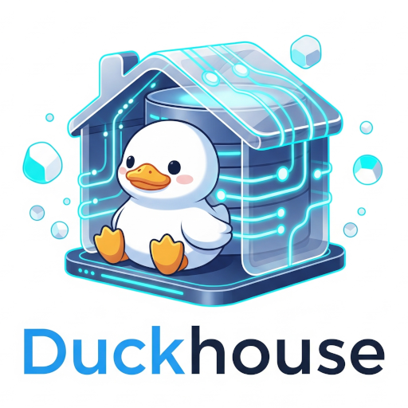

# koron/duckhouse

[](https://pkg.go.dev/github.com/koron/duckhouse)
[](https://github.com/koron/duckhouse/actions?query=workflow%3AGo)
[](https://goreportcard.com/report/github.com/koron/duckhouse)
[](https://deepwiki.com/koron/duckhouse)



Duckhouse は短寿命な DuckDB のインメモリインスタンスを提供する HTTP サーバーです。

cURL などにより DuckDB プレイグラウンドへクエリーを投げることができます。
インスタンスの寿命およびスコープはTCP接続の間に限定されます。
つまり Keep Alive 接続や HTTP/2 セッションの間だけ専用インスタンスが維持されます。

## Features

その他に以下のような機能があります

-   対応している出力フォーマット: CSV, HTML, Markdown, table (in plain text), AVRO
-   同時に起動できるDuckDBインスタンス数≒接続数 (デフォルト: 4)
-   DuckDBインスタンス毎の…
    -   スレッド数 (デフォルト: 1)
    -   メモリ (デフォルト: 1GiB)
    -   テンポラリディレクトリのサイズ (デフォルト: 10GiB)
    -   初期設定のロック/アンロック (デフォルト: ロック)
    -   カスタム可能な初期化スクリプト: [S3認証情報などの設定](https://github.com/koron/duckhouse/issues/16) に利用可能
-   アクセスログ
    表示内容の詳細は https://github.com/koron/duckhouse/issues/9 を参照
-   維持されているDuckDBインスタンスの一覧
-   実行中のクエリーの一覧
-   個別のクエリーのキャンセル
-   認証機能: クエリーとそのキャンセルに認証を要求可能
    - アクセスログ等に認証のIDを記録
    - BASIC認証/トークン認証
    - 認可不要の設定: 認証しなくても実行できる。認証情報があればIDは記録する

## Motivation

Duckhouse は以下の動機で生まれました。

-   DuckDBはOLAPツールとして S3 のファイルを読めて便利
-   ローカルのDuckDBから S3 にアクセスすると転送料がかかる → EC2で実行すれば転送料がかからない上に速くて「お得」
    -   集計結果のたった数行が欲しい
    -   一部とは巨大なファイルを舐めるから、総量は大きくなる
-   EC2インスタンスにログインしてDuckDBを実行するのは意外と手間 → HTTPサーバーで包んで cURL でアクセスするのが楽
    -   組織内で共有
    -   必要なのはかなり低めのセキュリティ

## Getting Started

### Install and Update

最新バイナリを以下からダウンロードして、実行ファイル `duckhouse` を適切なディレクトリに配置してください。

<https://github.com/koron/duckhouse/releases/latest>

`duckhouse` を起動すると、カレントディレクトリに `.duckdb` というディレクトリを作成し、
その中に DuckDB が必要としたディレクトリならびにファイルが作られます。
それらにはダウンロードした DuckDB Extensions やテンポラリファイルが含まれます。
詳しい仕様は https://github.com/koron/duckhouse/issues/19 を参照

自分でGoを用いてビルドする場合は、以下のようにコマンドを実行します。

```console
$ go install github.com/koron/duckhouse@latest
```

duckdb/duckdb-go-bindings を利用している関係で、
以下のアーキテクチャ以外ではこのコマンドが機能しません。

-   Windows (AMD64)
-   Linux (AMD64)
-   Linux (ARM64)
-   macOS (AMD64)
-   macOS (ARM64)

### First touch

まず duckhouse を起動します。
指定可能な起動オプションを知りたい場合は `duckhouse -h` を実行してください。

```console
$ duckhouse
2026/03/18 16:24:28 INFO listening on addr=localhost:9998
```

次に別の端末から cURL を用いてクエリーを duckhouse へ投げます。
デフォルトの出力フォーマットはCSVです。

```console
$ curl 'http://127.0.0.1:9998/' -d "SELECT version() as VER"
VER
v1.5.0
```

同じクエリーの結果を別のフォーマット(table)で受信します。

```console
$ curl 'http://127.0.0.1:9998/?f=table' -d "SELECT version() as VER"
┌────────┐
│  VER   │
├────────┤
│ v1.5.0 │
└────────┘
```

## エンドポイント

### クエリー実行

-   Path: `/`
-   Method: `POST` or `GET`
-   Request Parameters:
    -   クエリーの内容: BODY, `q` クエリー文字列, `query` クエリー文字列 (優先順)

        クエリーは `;` で接続することで1度に複数を順番に実行できます。
        その場合、出力は最後のクエリーのものになります。

    -   出力フォーマット指定: `format` クエリー文字列, `f` クエリー文字列 (優先順)

        現在指定可能なフォーマットは次の5つ: `csv` (default), `html`, `markdown`, `table`, `avro`

        各フォーマットにパラメータを指定できる場合は、以下のようなフォーマットで行う。

        ```
        {format}
        {format},{param1}:{value1}
        {format},{param1}:{value1},{param2}:{value2},...,{paramN}:{valueN}
        ```

-   Response Parameters:
    -   Status Code: `200`
    -   ヘッダー:
        -   `Content-Type`: 出力フォーマット次第
        -   `Duckhouse-Authnid` - 認証ID
        -   `Duckhouse-Connectionid` - 接続ID (DuckDBインスタンスの識別子)
        -   `Duckhouse-Duration` - クエリーにかかった時間
    -   ボディ: クエリーの結果

### 死活監視

-   Path: `/ping/`
-   Method: `GET`
-   Request Parameters: なし
-   Response Parameters:
    -   Status Code: `200`
    -   ボディ: `OK\r\n`

### DuckDBインスタンス(接続)一覧

-   Path: `/status/connections/`
-   Method: `GET`
-   Request Parameters: なし
-   Response Parameters:
    -   Status Code: `200`
    -   ヘッダー:
        -   `Content-Type`: `application/jsonlines`
    -   ボディ: 1行 = 1つのDuckDBインスタンスを示すJSONオブジェクト

        詳細は <https://github.com/koron/duckhouse/issues/11> の「接続情報」を参照

### クエリー一覧

-   Path: `/status/queries/`
-   Method: `GET`
-   Request Parameters: なし
-   Response Parameters:
    -   Status Code: `200`
    -   ヘッダー:
        -   `Content-Type`: `application/jsonlines`
    -   ボディ: 1行 = 1つのDuckDBインスタンスを示すJSONオブジェクト

        詳細は <https://github.com/koron/duckhouse/issues/11> の「クエリー情報」を参照
        
### クエリーキャンセル

-   Path: `/status/queries/{クエリーID}`
-   Method: `DELETE`
-   Request Parameters: なし
-   Response Parameters:
    -   Status Code: `204`
    -   ヘッダー:
        -   `Duckhouse-Authnid` - 認証ID
    -   ボディ: なし
